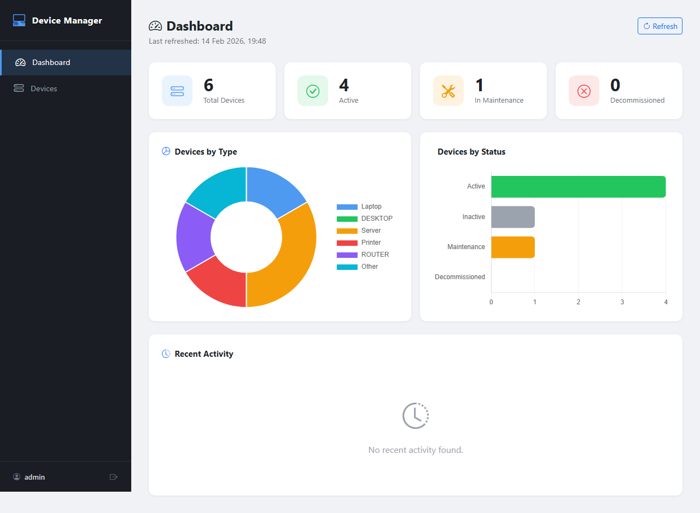
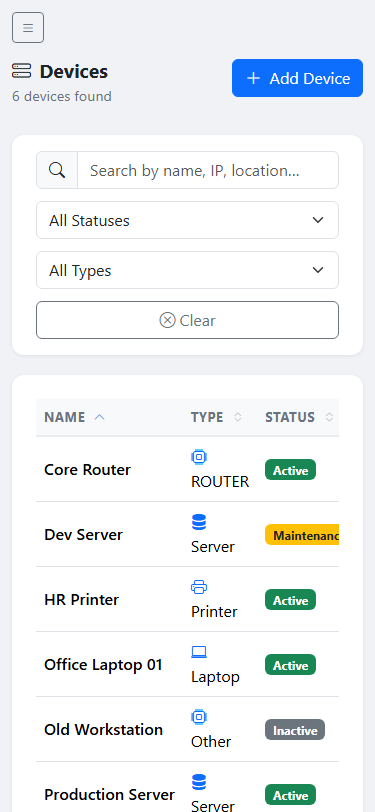

# Device Manager Web — Project 3

[](http://213.199.32.18/)

A responsive web dashboard for managing IT devices. Consumes the [device-manager REST API](https://github.com/mj-deving/device-manager) (Project 2) and mirrors its JavaFX client with a browser-based interface.

Built with zero build tools — no webpack, no npm, no transpilation. Just HTML, CSS, and JavaScript served as static files by nginx.

---

## Screenshots

| Desktop (Dashboard) | Mobile (Devices) |
|---|---|
|  |  |

---

## Features

- **Login** — Basic Auth credentials validated against the live API; session stored in `sessionStorage` (clears on tab close)
- **Dashboard** — Stat cards (total, active, maintenance, decommissioned) + Chart.js doughnut and horizontal bar charts, recent activity feed
- **Devices table** — Full-text search, status/type filters, multi-column sort, server-side pagination with smart ellipsis
- **CRUD** — Add/edit device modal with Bootstrap 5 validation; inline status quick-edit; delete with confirmation
- **Audit logs** — Per-device log history in a scrollable modal
- **Auto-refresh** — Background poll every 30 s (pauses while any modal is open)
- **Toast notifications** — Success/error feedback for every mutating action
- **Keyboard shortcuts** — `N` = new device, `/` = focus search, `Esc` = close modal
- **Responsive** — Sidebar collapses to hamburger at 768px; toolbar stacks vertically at 480px

---

## Tech Stack

| Layer | Tech |
|---|---|
| Structure | HTML5 (3 pages) |
| Styles | Bootstrap 5.3 + custom `css/app.css` |
| Behaviour | Vanilla JavaScript ES2020 (5 modules) |
| Charts | Chart.js 4 |
| Icons | Bootstrap Icons |
| Served by | nginx 1.24 (static files + reverse proxy) |

No build step. Open any `.html` file in a browser and it works.

---

## Project Structure

```
device-manager-web/
├── index.html              # Login page
├── dashboard.html          # Stats + charts
├── devices.html            # Device table (CRUD)
├── css/
│   └── app.css             # All custom styles (~425 lines)
├── js/
│   ├── api.js              # Fetch wrapper + all API calls (apiFetch, getDevices, …)
│   ├── auth.js             # Login, logout, requireAuth, getAuthHeader
│   ├── dashboard.js        # Stat cards, Chart.js charts, activity table
│   ├── devices.js          # Table render, sort/filter/paginate, CRUD modals
│   └── utils.js            # formatDate, statusBadge, typeIcon, showToast, …
├── nginx/
│   └── vps-apps.conf       # nginx config (source of truth for VPS routing)
├── screenshots/
│   ├── desktop-dashboard.png
│   └── mobile-devices.png
└── deploy.sh               # One-command deploy to VPS
```

---

## Quick Start (Local)

Serve with Python's built-in HTTP server (any port):

```bash
python3 -m http.server 8000
```

Then open `http://localhost:8000`. The app points at the live VPS API (`http://213.199.32.18/api/v1`), so you need a network connection and valid credentials.

> **Note**: `file://` won't work due to CORS — you need an HTTP server even locally.

---

## Deployment

One command from the repo root (requires clean working tree):

```bash
./deploy.sh
```

What it does:
1. Checks for uncommitted changes (fails if dirty)
2. Pushes to GitHub
3. `scp`s all HTML/CSS/JS to `/var/www/portfolio/` on the VPS
4. Smoke-tests the live URL (HTTP 200 check)
5. Creates and pushes a timestamped deploy tag (`deploy/web-YYYYMMDD-HHMM`)

Manual equivalent:

```bash
scp index.html dashboard.html devices.html dev@vps:/var/www/portfolio/
scp css/app.css dev@vps:/var/www/portfolio/css/
scp js/*.js dev@vps:/var/www/portfolio/js/
```

---

## API Endpoints Used

All requests go through `apiFetch()` in `api.js`, which injects the `Authorization: Basic …` header automatically.

| Method | Path | Used by |
|--------|------|---------|
| `GET` | `/api/v1/devices` | Device table (paginated, filtered, sorted) |
| `GET` | `/api/v1/devices/{id}` | Edit modal pre-fill |
| `POST` | `/api/v1/devices` | Create device |
| `PUT` | `/api/v1/devices/{id}` | Update device |
| `PATCH` | `/api/v1/devices/{id}/status` | Status quick-change |
| `DELETE` | `/api/v1/devices/{id}` | Delete device |
| `GET` | `/api/v1/devices/{id}/logs` | Audit log modal |
| `GET` | `/api/v1/stats` | Dashboard cards + charts |

---

## Keyboard Shortcuts

| Key | Action |
|-----|--------|
| `N` | Open "Add Device" modal |
| `/` | Focus the search box |
| `Esc` | Close open modal (Bootstrap built-in) |

---

## Learning Goals

See [LEARNING.md](LEARNING.md) for a deep-dive into the patterns demonstrated in this project:
Fetch API & async/await, DOM manipulation, client-side state management, CSS layout,
Bootstrap 5 integration, Chart.js, and browser authentication.

---

## Part of the Portfolio

| # | Project | Tech |
|---|---------|------|
| 1 | [device-inventory-cli](https://github.com/mj-deving/device-inventory-cli) | Java CLI, JDBC, HikariCP |
| 2 | [device-manager](https://github.com/mj-deving/device-manager) | Spring Boot, JavaFX 21 |
| **3** | **device-manager-web** (this repo) | **HTML/CSS/JS, Bootstrap 5, Chart.js** |
| 4 | [arcade-hub](https://github.com/mj-deving/arcade-hub) | Spring Boot, WebSocket |
